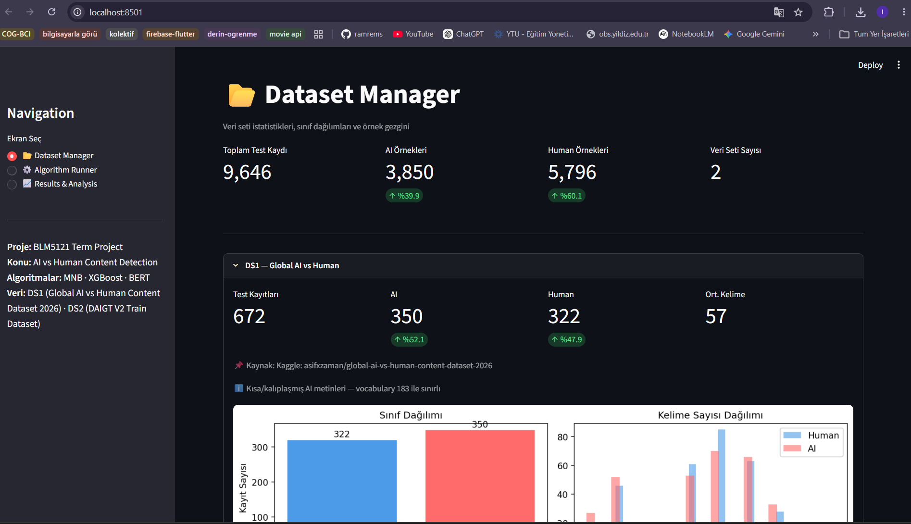
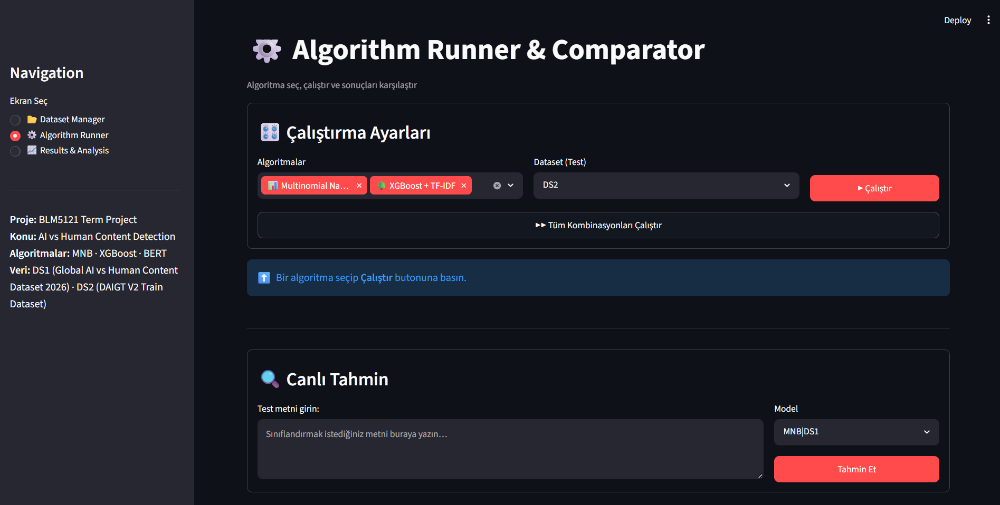
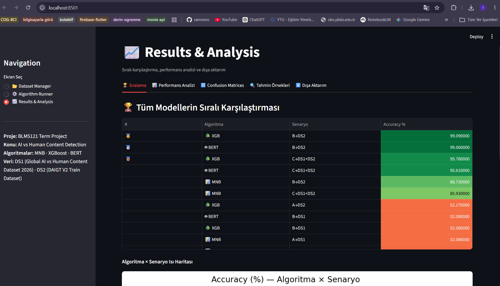
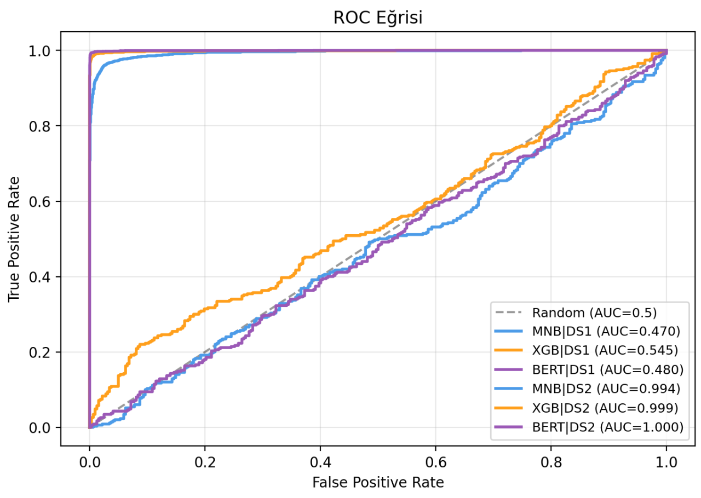
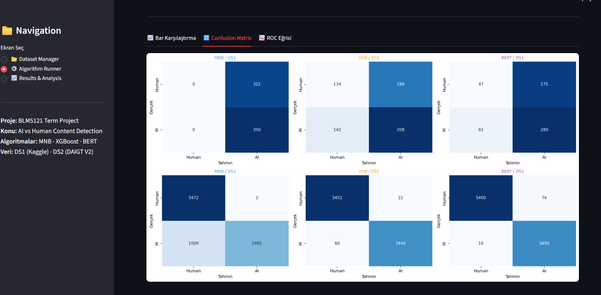
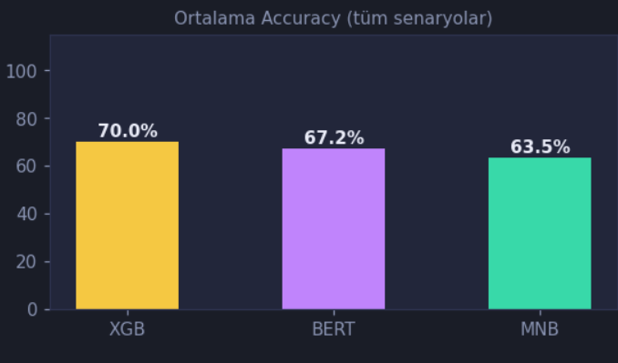

# BLM5121 — Web Mining Term Project

## AI vs Human Content Detection — Streamlit GUI

Bu proje, web üzerindeki metinlerin insan yazımı mı yoksa yapay zekâ (AI - GPT-4, Claude vb.) üretimi mi olduğunu tespit etmek amacıyla geliştirilmiş kapsamlı bir makine öğrenmesi ve web madenciliği (Web Content Mining) uygulamasıdır.

Çalışma kapsamında **Multinomial Naive Bayes (MNB)**, **XGBoost** ve **DistilBERT** mimarileri kullanılmış; veri sızıntısı (Data Leakage) temizlenmiş iki farklı veri seti (**DS1** ve **DS2**) üzerinde bu modellerin performans, hız ve kaynak tüketimi açısından karşılaştırmalı analizleri gerçekleştirilmiştir. Sonuçlar Streamlit tabanlı interaktif bir kullanıcı arayüzü ile sunulmuştur.

---

# 📑 İçindekiler

1. [Proje Özeti ve Motivasyon](#1-proje-özeti-ve-motivasyon)
2. [Dosya ve Proje Yapısı](#2-dosya-ve-proje-yapısı)
3. [Kurulum ve Çalıştırma Adımları](#3-kurulum-ve-çalıştırma-adımları)
4. [Veri Setleri ve Ön İşleme (Data Leakage)](#4-veri-setleri-ve-ön-işleme-data-leakage)
5. [Arayüz (GUI) Ekranları](#5-arayüz-gui-ekranları)
6. [Performans Analizi ve Grafiklerin Yorumlanması](#6-performans-analizi-ve-grafiklerin-yorumlanması)

   * [ROC Eğrisi Analizi](#roc-eğrisi-analizi)
   * [Confusion Matrix (Hata Matrisi) Analizi](#confusion-matrix-hata-matrisi-analizi)
   * [Genel Başarı Ortalaması (Overall Accuracy)](#genel-başarı-ortalaması-overall-accuracy)
7. [Sonuç ve Değerlendirme (Trade-off)](#7-sonuç-ve-değerlendirme-trade-off)

---

# 1. Proje Özeti ve Motivasyon

Büyük Dil Modellerinin (LLM) yaygınlaşmasıyla birlikte web içeriklerinin kaynağını doğrulamak; akademik dürüstlük, dezenformasyonun önlenmesi ve içerik kalitesinin korunması açısından kritik bir problem haline gelmiştir.

Bu proje, ham web metinlerinden anlamlı sinyaller çıkararak içerik kaynağını (**Human vs AI Provenance Detection**) tahmin etmeyi hedeflemektedir.

Projede klasik olasılıksal modeller (**Multinomial Naive Bayes**), modern ağaç tabanlı algoritmalar (**XGBoost**) ve Transformer tabanlı derin öğrenme mimarileri (**DistilBERT**) karşılaştırılmış; gerçek dünya senaryolarındaki **Maliyet–Doğruluk Ödünleşimi (Cost–Accuracy Trade-off)** detaylı biçimde incelenmiştir.

---

# 2. Dosya ve Proje Yapısı

Proje aşağıdaki dizin yapısına göre organize edilmiştir:

```text
streamlit_app/
├── app.py
├── utils.py
├── requirements.txt
├── README.md
├── assets/
│   ├── screen2-DS1_DS2.png
│   ├── screen1.png
│   ├── screen2.png
│   ├── screen3.png
│   ├── roc_curve.png
│   ├── all-models-confusion-matrix.png
│   ├── all-models-average.png
│   └── evaluation.png
├── pages/
│   ├── screen1_dataset.py
│   ├── screen2_runner.py
│   └── screen3_results.py
└── saved_models/
    ├── mnb_A.pkl
    ├── mnb_B.pkl
    ├── mnb_C.pkl
    ├── xgb_A.pkl
    ├── xgb_B.pkl
    ├── xgb_C.pkl
    ├── tfidf_1.pkl
    ├── mnb_vec_1.pkl
    ├── bert_A_state.pkl
    ├── bert_B_state.pkl
    ├── bert_C_state.pkl
    └── all_results.pkl
```

### Dosya Açıklamaları

| Dosya / Klasör     | Açıklama                                              |
| ------------------ | ----------------------------------------------------- |
| `app.py`           | Streamlit uygulamasının ana giriş noktası             |
| `utils.py`         | Yardımcı fonksiyonlar, model yükleme ve NLP işlemleri |
| `pages/`           | Çok sayfalı Streamlit ekranları                       |
| `assets/`          | Grafikler ve ekran görüntüleri                        |
| `saved_models/`    | Eğitilmiş model ağırlıkları                           |
| `requirements.txt` | Python bağımlılıkları                                 |
| `README.md`        | Proje dokümantasyonu                                  |

---

# 3. Kurulum ve Çalıştırma Adımları

## Adım 1 — Depoyu Klonlama

```bash
git clone <repo-url>
cd streamlit_app
```

## Adım 2 — Sanal Ortam Oluşturma

```bash
python -m venv venv
```

### Windows

```bash
venv\Scripts\activate
```

### Linux / macOS

```bash
source venv/bin/activate
```

## Adım 3 — Bağımlılıkları Kurma

```bash
pip install -r requirements.txt
```

## Adım 4 — Model Dosyalarını Eklemek

GitHub'ın 100 MB dosya sınırı nedeniyle `.pkl` uzantılı model dosyaları repoya dahil edilmemiştir.

Notebook eğitim sürecini çalıştırdıktan sonra elde edilen:

```text
saved_models/
```

klasörünü proje ana dizinine kopyalayınız.

## Adım 5 — Uygulamayı Başlatma

```bash
streamlit run app.py
```

Başarılı başlatma sonrasında uygulama aşağıdaki adreste açılır:

```text
http://localhost:8501
```

---

# 4. Veri Setleri ve Ön İşleme (Data Leakage)

Gerçek dünya verilerinde ezberleme (Overfitting) ve veri sızıntısını (Data Leakage) önlemek amacıyla kapsamlı bir ön işleme hattı oluşturulmuştur.

## DS1 — Kaggle Global AI vs Human

Otomatik analizlerde:

* `ai_model`
* `source`

sütunlarında ciddi veri sızıntıları tespit edilmiştir.

Metinlerdeki:

```text
(AI-generated)
```

benzeri ifadeler Regex ile temizlendiğinde:

* AI içeriklerinin belirli şablonlara dayandığı,
* Kelime çeşitliliğinin yaklaşık **183 token** seviyesine düştüğü,
* Ciddi bir **Vocabulary Collapse** problemi bulunduğu

gözlemlenmiştir.

## DS2 — DAIGT V2

Bu veri seti:

* Öğrenci kompozisyonları,
* ChatGPT çıktıları,
* Claude çıktıları

gibi farklı kaynaklardan oluşmaktadır.

Temizlik işlemleri sonrasında bile yaklaşık:

```text
15.000+
```

benzersiz token içermesi nedeniyle modeller için çok daha güçlü bir öğrenme ortamı sağlamıştır.

---

# 5. Arayüz (GUI) Ekranları

Uygulama üç temel ekrandan oluşmaktadır.

## 5.1 Sol Navigasyon Menüsü

Tüm ekranlar arasında geçiş yapılmasını sağlar.

---

## 5.2 Screen 1 — Dataset Manager

Bu ekranda:

* Ham veri setleri
* Temizlenmiş veri setleri
* Leakage öncesi / sonrası farklar
* Kelime dağılımları
* Vocabulary analizleri

interaktif olarak incelenebilmektedir.

<p align="center">
  
</p>
---

## 5.3 Screen 2 — Algorithm Runner & Live Prediction

Bu bölümde:

* MNB
* XGBoost
* DistilBERT

modelleri çalıştırılabilir ve sonuçları karşılaştırılabilir.

### Canlı Tahmin

Kullanıcı bir metin girerek sistemin:

* AI Generated
* Human Written

sınıflandırmasını gerçek zamanlı olarak görebilir.

<p align="center">
  
</p>
---

## 5.4 Screen 3 — Results & Analysis

Bu ekranda:

* Accuracy
* Precision
* Recall
* F1 Score
* ROC-AUC
* Çalışma süreleri
* Cross-dataset test sonuçları

görselleştirilmektedir.

<p align="center">
  
</p>
---

# 6. Performans Analizi ve Grafiklerin Yorumlanması

Bu bölüm uygulama tarafından üretilen sonuçların akademik değerlendirmesini içermektedir.

---

## ROC Eğrisi Analizi
<p align="center">
  
</p>

### DS1 Sonuçları

DS1 üzerinde tüm modellerin ayırt edicilik gücü ciddi biçimde düşmüştür.

| Model      | AUC   |
| ---------- | ----- |
| MNB        | 0.470 |
| XGBoost    | 0.545 |
| DistilBERT | 0.480 |

Eğriler rastgele tahmin çizgisine (AUC ≈ 0.5) yakın seyretmektedir.

### DS2 Sonuçları

| Model      | AUC   |
| ---------- | ----- |
| XGBoost    | 0.999 |
| DistilBERT | 1.000 |

Neredeyse kusursuz ayrım gerçekleştirilmiştir.

### Çıkarım

Aynı modeller DS2 üzerinde %99 seviyesine çıkarken DS1 üzerinde %50 bandında kalmaktadır.

Bu durum algoritmalardan ziyade DS1 veri setinin:

* Gürültülü,
* Kalitesiz,
* Öğrenilmesi zor,
* Vocabulary Collapse içeren

bir yapıya sahip olduğunu göstermektedir.

---

## Confusion Matrix (Hata Matrisi) Analizi
<p align="center">
  
</p>
### MNB'nin Karakteristik Zafiyeti

DS2 üzerinde:

* İnsan metinlerini başarıyla tespit etmiş,
* Ancak yaklaşık **1.009 AI metnini insan olarak sınıflandırmıştır.**

Bu durum Naive Bayes'in:

> Feature Independence Assumption

varsayımından kaynaklanmaktadır.

---

### XGBoost ve DistilBERT

DS2 hata matrislerinde:

* True Positive
* True Negative

değerleri baskındır.

Her iki model de iki sınıfı yüksek doğrulukla ayırabilmiştir.

---

### DS1 Sonuçları

DS1 hata matrislerinde:

* Rastgele sınıflandırma,
* Tek sınıfa yığılma,
* Kararsız karar sınırları

açık biçimde gözlenmektedir.

---

## Genel Başarı Ortalaması (Overall Accuracy)

<p align="center">
  
</p>

Cross-dataset testleri dahil edildiğinde:

| Model      | Ortalama Başarı |
| ---------- | --------------- |
| XGBoost    | %70.0           |
| DistilBERT | %67.2           |
| MNB        | %63.5           |

### Yorum

Sonuçlar, TF-IDF ile beslenen XGBoost'un:

* Gürültülü veri üzerinde,
* Dağılım değişimlerinde,
* Veri setleri arası geçişlerde

Transformer tabanlı modellere göre daha kararlı çalışabildiğini göstermektedir.

---

# 7. Sonuç ve Değerlendirme (Trade-off)

Bu çalışma sonucunda AI içerik tespiti problemi için en dengeli yaklaşımın **XGBoost** olduğu görülmüştür.

## Hesaplama Maliyeti

DS2 veri seti üzerinde:

| Model      | Accuracy | Süre          |
| ---------- | -------- | ------------- |
| DistilBERT | %99.1    | 13.124 saniye |
| XGBoost    | %99.1    | 10.2 saniye   |

DistilBERT benzer doğruluğa ulaşabilmek için çok daha yüksek hesaplama maliyeti gerektirmektedir.

---

## Semantik Bilgi vs Yapısal Örüntüler

AI içerik tespiti problemi:

* Semantik anlamdan ziyade,
* Kelime kullanımı,
* Tekrarlayan yapılar,
* Leksikal örüntüler

üzerinden ayrışmaktadır.

Bu nedenle TF-IDF + XGBoost kombinasyonu son derece başarılı sonuçlar vermektedir.

---

## Nihai Sonuç

Bu çalışmada:

* En yüksek doğruluk DistilBERT tarafından elde edilmiştir.
* En iyi maliyet/doğruluk dengesi XGBoost tarafından sağlanmıştır.
* En düşük kaynak tüketimi MNB tarafından sunulmuştur.

Gerçek dünya kullanım senaryolarında değerlendirildiğinde, **XGBoost tabanlı çözüm en pratik ve ölçeklenebilir yaklaşım olarak öne çıkmaktadır.**
